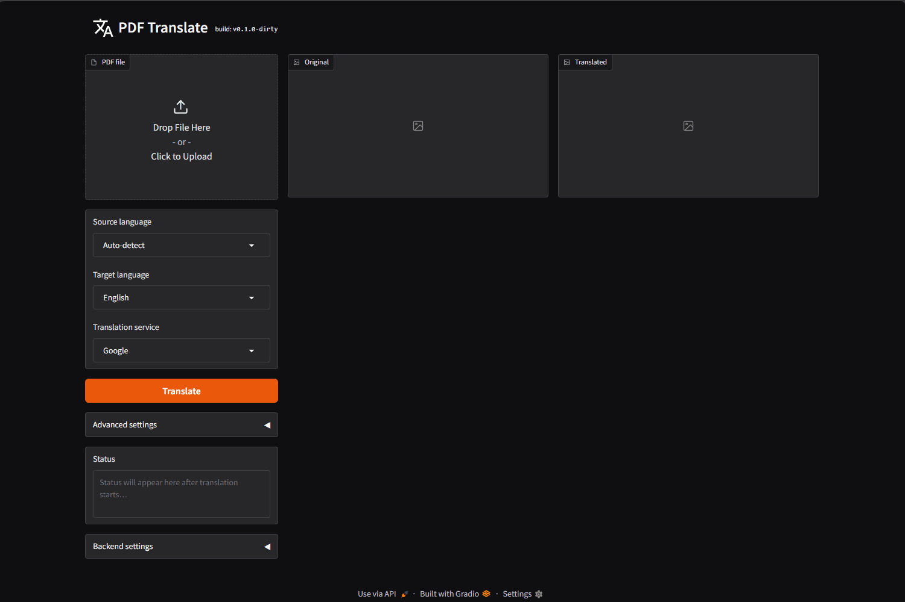

# 🌐 PDF Translate

**Self-hosted PDF translation that keeps your documents private.**

Upload a PDF, pick your languages and backend, get a translated PDF — with the original layout intact. No cloud accounts. No file size limits. No data leaving your network.

[](https://github.com/jctots/pdf-translate/actions/workflows/tests.yml)
[](LICENSE)
[](https://github.com/jctots/pdf-translate/pkgs/container/pdf-translate)



**Try it yourself** — click to open each file:

| File | Description |
|------|-------------|
| [demo-document-de.pdf](docs/assets/demo-document-de.pdf) | Input — fake German medical letter (the demo document) |
| [demo-document-de_en.pdf](docs/assets/demo-document-de_en.pdf) | Output — translated PDF (layout preserved) |
| [demo-document-de_de_en.pdf](docs/assets/demo-document-de_de_en.pdf) | Output — side-by-side PDF (original \| translation) |
| [demo-document-de_de_en.html](docs/assets/demo-document-de_de_en.html) | Output — HTML reading view |

## ✨ Why pdf-translate?

Most PDF translation tools either **send your files to the cloud** or **destroy the layout**. pdf-translate does neither.

- 🔒 **Privacy-first** — use Ollama or LibreTranslate and your PDFs never leave your machine or LAN
- 📐 **Layout preserved** — text is placed back at the original position; images, tables, and structure stay intact
- 🖥️ **Self-hosted** — Docker Compose in two minutes; runs on any machine or home server
- 🔌 **REST API included** — automate with curl, Python, or any scripting environment
- 🗂️ **Paperless-ngx ready** — webhook container auto-translates ingested documents; companion PDF linked and searchable
- 🔍 **Scanned PDF support** — Tesseract OCR and Ollama vision models (glm-ocr) handle image-only PDFs
- 📄 **Three output formats** — translated PDF, side-by-side comparison PDF, HTML reading view

## 📊 How it compares

| | pdf-translate | pdf2zh-next | Adobe Acrobat | Google Translate | DeepL |
|---|---|---|---|---|---|
| **Self-hosted** | ✅ | ✅ | ❌ | ❌ | ❌ |
| **Privacy** | ✅ No cloud | ✅ No cloud | ❌ Cloud | ❌ Cloud | ❌ Cloud |
| **Layout preserved** | ✅ | ✅ | ✅ | ⚠️ Partial | ⚠️ Partial |
| **Scanned PDFs (OCR)** | ✅ | ❌ | ✅ | ❌ | ❌ |
| **REST API** | ✅ | ❌ | ❌ | ❌ | ✅ Paid |
| **Math / formulas** | ❌ | ✅ | ✅ | ❌ | ❌ |
| **Setup complexity** | 🟢 Simple | 🟡 Moderate | 🔴 Subscription | 🟢 None | 🟢 None |
| **Cost** | Free | Free | $20+/mo | Free (10 MB limit) | Freemium |

**When to choose pdf-translate:** general documents — manuals, reports, contracts, invoices, scanned archives. Not the right tool for academic papers with LaTeX formulas (use [pdf2zh-next](https://github.com/pdf2zh/pdf2zh-next) for those).

## 🚀 Quick start

### 🐳 Docker (recommended — private by default)

**Requires:** Docker and Docker Compose.

```bash
git clone https://github.com/jctots/pdf-translate.git
cd pdf-translate
docker compose up -d
open http://localhost:7860
```

**LibreTranslate starts alongside pdf-translate — your documents never leave your network.**
First startup downloads ~2 GB of language models; subsequent starts are instant.

To use an external LibreTranslate instance or Ollama instead, see [docs/backends.md](docs/backends.md).

### 🐍 Bare Python (testing only)

```bash
python -m venv .venv
source .venv/bin/activate   # Windows: .venv\Scripts\activate
pip install -r requirements.txt
python app.py
```

> ⚠️ **The bare Python install defaults to Google Translate** — your PDF text is sent to Google's servers. This is intentional for quick local testing, but not suitable for sensitive documents. Switch to LibreTranslate or Ollama in the UI before translating anything private.

## 🔧 Translation backends

| Backend | Privacy | Requires | Best for |
|---------|---------|---------|---------|
| **Ollama** | 🔒 Local | Ollama + a translation model | Sensitive documents, offline use |
| **LibreTranslate** | 🔒 Local | Self-hosted LT instance | Open-source, no cloud dependency |
| **Google Translate** | ☁️ Cloud | Internet access | Quick tests and public documents only |

Switch backends in the UI or via API — no restart needed.

## 📦 Output formats

Every translation produces three files:

| Output | Description |
|--------|-------------|
| **Translated PDF** | Original layout, translated text. Selectable and searchable. |
| **Side-by-side PDF** | Original \| Translation in landscape. Layout-matched for visual comparison. |
| **HTML reading view** | Clean, reflowable — original and translated text side by side. Easiest to read when translated text is small. |

## 🔌 REST API

The same port serves a REST API alongside the Gradio UI:

```bash
# Translate a PDF
curl -X POST http://localhost:7860/api/translate \
  -F "file=@document.pdf" \
  -F "source=de" -F "target=en" \
  --output translated.pdf

# Check status
curl http://localhost:7860/api/health

# Cancel a running translation
curl -X DELETE http://localhost:7860/api/translate
```

Swagger UI at [`/docs`](http://localhost:7860/docs) · Full reference in [docs/api.md](docs/api.md)

## 🗂️ Paperless-ngx integration

Automatically translate documents as they arrive in [Paperless-ngx](https://docs.paperless-ngx.com/). A companion translated PDF is uploaded alongside the original and linked as a **Document Link** custom field — fully local, no cloud.

```bash
# Add to your Paperless docker-compose.yml
services:
  pdf-translate-webhook:
    image: ghcr.io/jctots/pdf-translate-paperless-webhook:latest
    environment:
      PAPERLESS_URL: http://paperless-ngx:8000
      PAPERLESS_API_TOKEN: ${PAPERLESS_API_TOKEN}
      PDF_TRANSLATE_URL: http://<pdf-translate-host>:7860
      TRANSLATE_SOURCE_LANG: de   # or "auto" for all languages
      TRANSLATE_TARGET_LANG: en
```

Then configure a Paperless Workflow (Settings → Workflows) to POST to `http://pdf-translate-webhook:8081/webhook` on document added.

Full setup guide: [paperless_webhook/README.md](paperless_webhook/README.md)

## 🛠️ Advanced options

| Option | Default | Purpose |
|--------|---------|---------|
| **Force OCR** | Off | Ignore the text layer; OCR every page as an image. For scanned or mixed PDFs. |
| **Merge split lines** | Off | Merge word-level fragments before translation. For DTP/InDesign PDFs with many small blocks. |
| **Detect table cells** | On | Shrink-to-fit text within table cells to preserve table structure. |
| **Filter icon glyphs** | On | Strip icon font characters that would otherwise appear as random letters. |
| **Allow text reflow** | Off | Collapse hard line breaks within paragraphs before translating. |

## 📚 Documentation

| Doc | Contents |
|-----|---------|
| [User guide](docs/user-guide.md) | All UI options explained in detail |
| [API reference](docs/api.md) | REST API endpoints, timeouts, queue behaviour |
| [Backends](docs/backends.md) | Ollama and LibreTranslate setup (local + Docker Compose) |
| [Paperless-ngx](paperless_webhook/README.md) | Webhook container — auto-translate on ingest |
| [Testing](docs/testing.md) | Running the test suite |

## 🤝 Contributing

See [CONTRIBUTING.md](CONTRIBUTING.md). All HTTP calls in the test suite are mocked — no live services needed to run tests.

## 📄 License

MIT — see [LICENSE](LICENSE).
Bundled Liberation fonts: SIL Open Font License.

*Built with [Claude Code](https://claude.ai/code) by Anthropic.*
